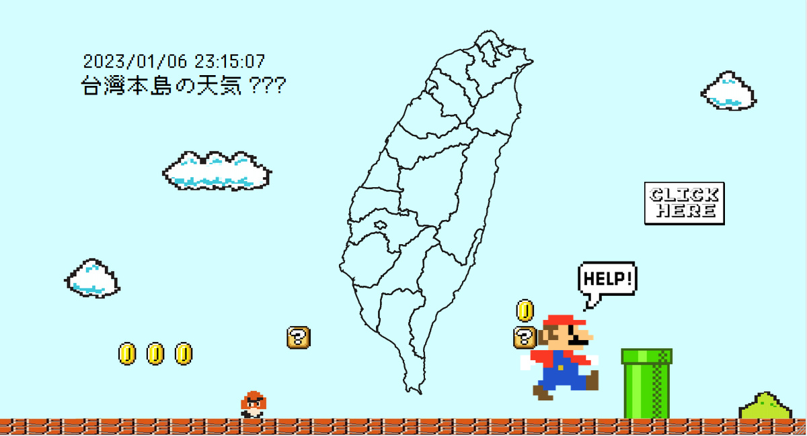
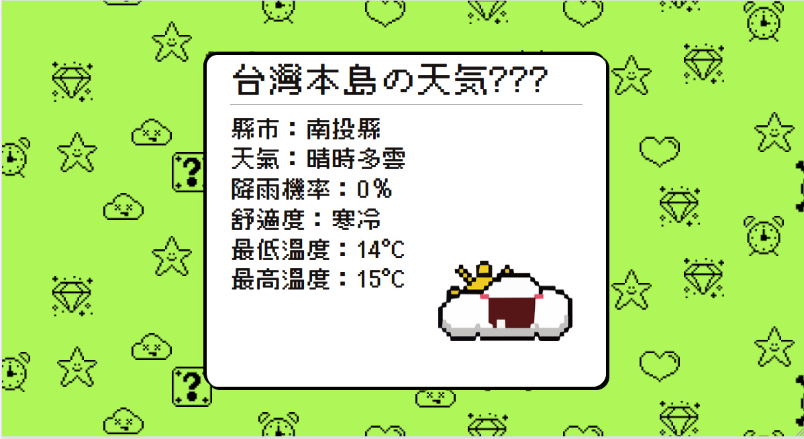

# ✨ マリオ 4 fun ✨✨

## 什麼是 マリオ 4 fun ???

### **LIVE DEMO**: https://yangunli.github.io/weather-map/

### 復古口味 **4fun** 一下，即時天氣網頁

- 基本靜態網頁三元素(HTML、CSS、Javascript)組成
- 加點 neo-brutalism，再加點 8-bit 組成我們的 Web design

#### 亂踩煞車的天氣卡，以及跟著天氣狀況 ☁⛅⛈ 更動的背景色

## 成員及任務

1. Yangun Li 🌟 **組長**

   - 動畫實作

   * 選單主視覺
   * 天氣卡主視覺
   * 天氣卡背景圖
   * 撰寫 README
   * 其他功能合併修正
   * Repositories Owner

   - code reviewer and merge banch

1. Jamie Yu 🌟
   - 串接天氣 API 資料
   - 實作時間功能
   * 其他功能合併修正
1. Joyce Liu 🌟

   - 鍵盤動作功能

   * 主視覺底圖繪製

   - 實作偵測選單滑鼠功能

   * 天氣卡背景色及 Weather Icons JS 邏輯撰寫

   * 其他功能合併修正

1. Zora Wu 🌟
   - 調整 RWD
   - 繪製 Weather Icons 及其他素材
   * 其他功能合併修正
1. Owen Fang 🌟
   - 初版鍵盤動作功能
   * 上下切換功能

## 參考資料

1. 中央氣象局開放資料平臺

   - https://opendata.cwb.gov.tw/dist/opendata-swagger.html

1. 台灣 svg

   - https://codepen.io/SimonAllen/details/eRyXqV

1. Streamline (pixel icons)

   - https://codepen.io/SimonAllen/details/eRyXqV

1. 俐方體 11 號(Font)

   - https://github.com/ACh-K/Cubic-11

1. Pixel Art Maker(Pixel Elements)

   - http://pixelartmaker.com/

1. weather icons 原型

   - https://www.freepik.com/premium-vector/pixel-art-weather-emoticon-design-set_10930083.htm

1. google 大神裡有關 gba 的一切
